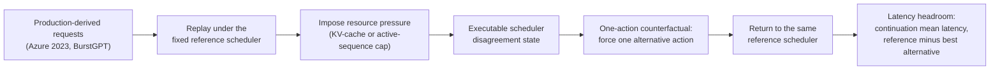

# llm-serving-heuristic-evolution

This repository measures **when changing an LLM-serving scheduler creates an
actionable performance opportunity**. In simulated replay of production-derived
traces, it finds the states where alternative schedulers would take a different
executable action and estimates the one-step causal latency headroom available
at those states.

It also contains a larger, older research program on scheduler selection and
composition. That work is summarized [below](#broader-repository-historical-work)
and is not needed to understand the current study.

## Current Study

**When Does LLM-Serving Scheduler Adaptation Matter? Action Opportunity and
Causal Headroom in Production-Derived Replay.** Soroush Vahidi, New Jersey
Institute of Technology. Manuscript and reproducibility package.

**Problem.** Adaptive scheduling (switching scheduling policies at runtime) can
only pay off if the system reaches states where another policy would take a
*different executable action* and that action would actually help. Whole-trace
scheduler comparisons cannot show how often this happens. A policy can win on
average without being the best choice at every decision, and two policies can
have different scores while taking identical actions almost everywhere. This
study measures the opportunity directly, before any adaptive controller is
designed.

**Why this matters.** If schedulers rarely disagree on what to do, no runtime
selector or controller can gain anything, however good its predictions. If they
disagree, the remaining question is whether the alternative action is better.
The study separates these questions: first, how often does disagreement occur;
second, when it does occur, how much latency could one different decision save.

## Main Result at a Glance

All latencies below are **simulator time** (one simulated GPU, fixed 1 ms
step, no hardware-calibrated service curves). They are not real-GPU
milliseconds.

| Condition / quantity | Result |
|---|---|
| Native, resource-abundant replay (Azure code, Azure conversation, BurstGPT) | **0 executable disagreement states** out of 1,002,438 reference decision states (about one million) |
| Arrival-rate scaling alone (tested up to 8×) | **0 disagreement states in the tested range**: KV utilization stayed below 1% of capacity and no resource limit became binding. This does not show that higher load could never create disagreement |
| KV-cache capacity or active-sequence caps | **Disagreement appears** on the Azure traces. On fresh windows BurstGPT never queued enough for the caps to bind |
| Fresh disagreement states (pre-specified causal analysis) | **720** states from 36 source windows |
| States with a beneficial alternative (pre-specified rule) | **590 / 720 = 81.9%** of *disagreement* states. Disagreement itself is below 0.5% of reference decisions in every selected regime |
| Mean oracle latency headroom | **1.9958 ms simulated** (95% window-clustered CI 0.19–3.55 ms). Median **0.197 ms**. One window holds 88% of the total. In 14% of states every alternative is worse |
| Bounded real-vLLM probe | Shows that **resource pressure changes scheduling behavior** in a real engine. It does **not** validate the simulated latency magnitude |

The headroom is real in this simulator, but it is sparse, concentrated, and
conditional on the reference scheduler. Finding it does not show that
adaptation is worthwhile in deployment.

## How the Experiment Works



1. **Replay.** Production-derived request windows (Azure LLM inference 2023
   code and conversation, BurstGPT) are replayed in a discrete-event serving
   simulator under a fixed reference scheduler.
2. **Disagreement.** At every reference decision state, six policies are asked
   what they would do. A *disagreement state* is a state where at least one
   alternative proposes a different **feasible, executable** action: a different
   admission, batch, or request-ordering decision once infeasible and
   semantically identical variants are collapsed. A ranking change that leads
   to the same admission, batch, and order does not count.
3. **Pressure.** Without resource pressure no disagreement occurs, so KV-cache
   capacity or the active-sequence limit is capped to expose scheduling choices.
4. **One-step counterfactual.** At each disagreement state, the simulator forces
   exactly **one alternative scheduling decision**. "One step" means one
   scheduler decision. It does not mean one token, one millisecond, or one
   request.
5. **Common continuation.** Right after that one decision, control returns to
   the same reference scheduler. The reference branch and every alternative
   branch therefore differ only in that single decision.
6. **Headroom.** The outcome is the mean end-to-end latency of the
   continuation request population: every request of the window not yet
   completed at the decision (running, queued, and future arrivals). Both
   branches are scored on exactly the same requests. A state is *beneficial*
   if some alternative gives lower mean latency than the reference. Its oracle
   headroom is the largest such reduction (zero if none).

The reference scheduler is the KV-constrained online policy. It had the highest
mean goodput among the six policies on an earlier, separate 240-scenario
benchmark and was fixed before the fresh evaluation. It is **not** claimed to be
globally optimal. "Best fixed scheduler" means best on average on that
benchmark, not best action at every state.

## What the Study Does NOT Claim

- **Not a production or deployment improvement.** All headroom is measured in
  a simulator.
- **Not a 2 ms real-GPU latency gain.** Simulated milliseconds are not
  hardware milliseconds, and the vLLM probe did not reproduce the simulated
  magnitude.
- **Not proof that switching is always useful.** 81.9% applies only to
  disagreement states, which are a small fraction of all decisions. In 14% of
  them every alternative is worse.
- **Not a trained selector or adaptive controller.** The study measures
  opportunity (oracle headroom). No controller is proposed or evaluated.
- **Not general superiority of any scheduler.** The six policies are simple,
  oracle-informed heuristics (they know the true output length), not
  reimplementations of published serving systems. Results depend on the chosen
  reference.

## Start Here

1. **Manuscript (PDF):**
   [`paper/when_does_llm_serving_scheduler_adaptation_matter.pdf`](paper/when_does_llm_serving_scheduler_adaptation_matter.pdf).
   LaTeX source, figures, and figure scripts are in
   [`paper/performance_evaluation/`](paper/performance_evaluation/).
2. **Reproducibility entry point:** [`REPRODUCIBILITY.md`](REPRODUCIBILITY.md).
   The current-study documentation index is
   [`docs/current/README.md`](docs/current/README.md).
3. **Key confirmatory artifacts:**
   - Fresh causal headroom study (protocol, states, actions, result, bootstrap):
     [`experiments/fresh_production_latency_headroom_confirmatory_v1/`](experiments/fresh_production_latency_headroom_confirmatory_v1/)
   - Native replay (Phase A):
     [`experiments/industry_realism_action_opportunity_phase_a_v1/`](experiments/industry_realism_action_opportunity_phase_a_v1/)
   - Resource-pressure map (Phase B v2):
     [`experiments/industry_realism_action_opportunity_phase_b_v2/`](experiments/industry_realism_action_opportunity_phase_b_v2/)
   - Post hoc robustness and concentration:
     [`experiments/fresh_production_latency_headroom_confirmatory_v1_robustness/`](experiments/fresh_production_latency_headroom_confirmatory_v1_robustness/)
   - Claim-to-artifact manifest (every quantitative claim, its source file and
     field): [`paper/performance_evaluation/FINAL_CLAIM_MANIFEST.json`](paper/performance_evaluation/FINAL_CLAIM_MANIFEST.json)
4. **Main simulator and policy code:**
   - Simulator: [`src/llmserveopt/simulator/`](src/llmserveopt/simulator/)
   - Policies, including the reference
     [`kv_constrained_online.py`](src/llmserveopt/policies/kv_constrained_online.py):
     [`src/llmserveopt/policies/`](src/llmserveopt/policies/)
   - This study's replay configuration (1 ms step, service model):
     [`src/llmserveopt/policy_separation/public_trace_replay_v1.py`](src/llmserveopt/policy_separation/public_trace_replay_v1.py)
   - Runners: [`scripts/industry_realism_action_opportunity_phase_a_v1.py`](scripts/industry_realism_action_opportunity_phase_a_v1.py),
     [`scripts/industry_realism_action_opportunity_phase_b_v2.py`](scripts/industry_realism_action_opportunity_phase_b_v2.py),
     [`scripts/fresh_latency_causal_confirmatory_v1.py`](scripts/fresh_latency_causal_confirmatory_v1.py)
5. **Bounded real-vLLM evidence** (one RTX 5060 Ti, vLLM 0.27.1,
   Qwen2.5-0.5B-Instruct):
   [`experiments/real_vllm_pressure_action_validation_v1/REAL_VLLM_VALIDATION_RESULT_V1.json`](experiments/real_vllm_pressure_action_validation_v1/REAL_VLLM_VALIDATION_RESULT_V1.json)
   and
   [`experiments/real_vllm_mechanism_validation_v1/native_vllm_chunk_budget_semantics_probe_v1/`](experiments/real_vllm_mechanism_validation_v1/native_vllm_chunk_budget_semantics_probe_v1/).

**Archive.** The v1.1.0 reproducibility package is on Zenodo at
[10.5281/zenodo.22866983](https://doi.org/10.5281/zenodo.22866983) (concept DOI
[10.5281/zenodo.22865293](https://doi.org/10.5281/zenodo.22865293)). A copy is
in [`release/performance_evaluation_v1_1_0/`](release/performance_evaluation_v1_1_0/).
The post hoc reference-reserve sensitivity analysis came later than that archive
and is only in this repository, under
[`experiments/reference_reserve_sensitivity_v1/`](experiments/reference_reserve_sensitivity_v1/).

## Reproduce / Verify

Checking the paper's numbers needs no simulation or GPU:

```bash
python3 -m pip install -e ".[dev]"

# Recompute every quantitative claim from the committed artifacts and check it against main.tex
python3 paper/performance_evaluation/scripts/build_claim_manifest.py --check

# Regenerate the manuscript figures from the frozen artifacts
# (overwrites paper/performance_evaluation/figures/; byte-identical with matplotlib 3.10.9,
#  otherwise restore with: git checkout -- paper/performance_evaluation/figures)
python3 paper/performance_evaluation/scripts/plot_performance_evaluation_figures.py
python3 paper/performance_evaluation/scripts/plot_regime_figures.py
python3 paper/performance_evaluation/scripts/plot_robustness_figures.py
```

To verify the self-contained v1.1.0 archive (checksums, frozen-artifact hashes,
the 62 claims it covers, figures, correction replay), run its verifier. The
tracked directory and an unpacked copy of the committed ZIP both work. With
the library versions in the archive's `ENVIRONMENT.json` it reports 7/7. With
newer numpy or pandas, one check reports a difference in recorded library
versions only (see [`release/README.md`](release/README.md)):

```bash
cd release/performance_evaluation_v1_1_0 && python3 verify_release.py
```

Re-running the simulations themselves needs the raw upstream traces, which are
not redistributed here. The fresh causal execution was run on an HPC cluster.
[`REPRODUCIBILITY.md`](REPRODUCIBILITY.md) lists the details, the data sources,
and the documented corrections (including why the protocol is called
*pre-specified* rather than *preregistered*).

## Broader Repository (Historical Work)

The repository started as a broader research program on online LLM-serving
scheduler portfolios. That earlier work used other simulator configurations
(including GPU-calibrated service models) and a different primary metric
(arrival-normalized weighted goodput, ANWG). It is kept for provenance and is
**not** part of the current study's evidence:

- **Scheduler selection:** per-scenario best-policy (VBS) versus best fixed
  policy (SBS) on a 240-scenario joint benchmark, plus contextual and online
  selectors. Lightweight online selectors did not beat SBS.
- **Policy composition and DSL/synthesis:** within-scenario composition of
  parent policies and typed-DSL heuristic synthesis. Composition was demoted
  after a structural reassessment, and both remain exploratory.
- **External scheduler baselines:** adapters for Apt-Serve, VTC, PARS, Sarathi,
  DistServe, Llumnix and others. See [`docs/BASELINE_STATUS.md`](docs/BASELINE_STATUS.md).
- **Earlier manuscripts:** an LLM 2026 conference manuscript (withdrawn before
  publication, [`paper/history/llm2026/`](paper/history/llm2026/)) and an
  earlier FGCS-oriented package ([`paper/history/fgcs/`](paper/history/fgcs/)).
  Both are superseded.
- **Other simulator configurations, calibrations, and real-LLM pilots** under
  [`configs/`](configs/) and [`experiments/`](experiments/).

## Repository Layout

```text
paper/                     manuscript PDF; paper/performance_evaluation/ = source, figures, claim manifest   [current study]
experiments/               committed artifacts; the current study's directories are listed in "Start Here"  [current + historical]
release/                   v1.1.0 reproducibility archive for the current study                            [current study]
src/llmserveopt/           library: simulator, policies, workloads, selectors, DSL                          [simulator/ and policies/ used by current study]
scripts/                   experiment runners and analysis; most serve historical studies                   [mixed]
tests/                     pytest suite, including historical phase regression tests
configs/                   experiment and calibration configs (mostly historical studies)
baselines/, external/      external-scheduler adapters and provenance                                       [historical]
benchmarks/                workload suites (historical selector studies)
docs/                      documentation index, current status, design docs, dated audits                   [mostly historical]
data/, results/            local datasets and generated outputs; large/raw files are gitignored
```

## Install and Test

```bash
python3 -m pip install -e ".[dev]"            # core
python3 -m pip install -e ".[selector]"       # optional: selector models (historical studies)
python3 -m pytest --collect-only -q
LLMSERVEOPT_RUN_GPU_TESTS=1 python3 -m pytest -m gpu   # opt-in GPU/checkpoint tests
```

[CI](.github/workflows/ci.yml) runs the deterministic, CPU-only test subset on
Python 3.12 with no GPU, credentials, or network access beyond package
installation. Tests that need uncommitted datasets (the public trace corpus
parquet files, staged BurstGPT), the optional `transformers` tokenizer, a GPU,
HPC/SLURM, real vLLM, or external APIs are excluded from CI or skip
automatically when their prerequisites are missing.

## Historical Work and Provenance

- Current-study documentation index (evidence reports, artifacts, scope):
  [`docs/current/README.md`](docs/current/README.md). The full documentation
  index, ordered from current to historical, is [`docs/README.md`](docs/README.md).
- Handoff for the SBS-override selector research line, which ended on
  2026-09-19 without confirming a positive result:
  [`docs/current/RESUME_HERE.md`](docs/current/RESUME_HERE.md) (historical).
- Long-term research-program roadmap (last reconciled in August 2026, so it
  predates the current study): [`docs/PROJECT_MAP.md`](docs/PROJECT_MAP.md).
- Dated scientific and technical audits: [`docs/audits/`](docs/audits/). They
  record point-in-time evidence, not current status.
- Superseded FGCS roadmap:
  [`docs/current/FGCS_SUBMISSION_ROADMAP_20260920.md`](docs/current/FGCS_SUBMISSION_ROADMAP_20260920.md).

Frozen artifacts are never edited in place. Corrections are added as separate,
documented derivatives (for example
[`experiments/fresh_production_latency_headroom_confirmatory_v1_corrected/`](experiments/fresh_production_latency_headroom_confirmatory_v1_corrected/)).
Generated results under `results/` are not version-controlled.

## Citation and License

To cite the study's reproducibility package, use the Zenodo record above.
[`CITATION.cff`](CITATION.cff) describes the repository as software. Licensed
under MIT; see [`LICENSE`](LICENSE).
