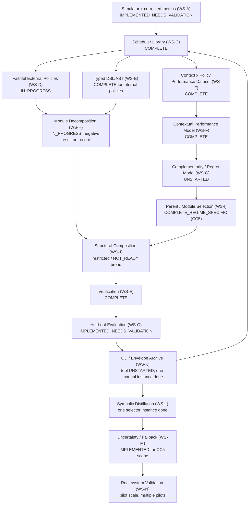

# Project Map — Canonical Research Roadmap

> **THIS FILE IS THE CANONICAL PROJECT ROADMAP.**
> Update it whenever a phase changes status, a major result invalidates an
> earlier assumption, or the exact next action changes. If a status claim
> elsewhere in the repository conflicts with this file, treat this file as
> authoritative and go fix the conflict — do not silently defer to the
> other document.
>
> **Not to be confused with `docs/current/PROJECT_MAP.md`**, which is a
> narrow "where do I look in the codebase" navigation index (paths and
> maturity levels for the simulator, policies, DSL, datasets, etc.). This
> file is the research-program roadmap: what the project is trying to
> prove, what workstream every phase belongs to, what is scientifically
> established vs. hypothesized, and what the dependency-ordered path to
> the end system looks like. Read the navigation file to find code; read
> this file to understand why the code exists and what comes next.

Last reconciled: **2026-08-07**, against commit
`891881281b650f549b0bbebaa49df8182e535ba8` ("feat: complete Apt-Serve
Phase F stress validation", `contextual-compositional-heuristics-20260731`)
— this file's own commit lands immediately after it. See §6 for the
full committed-checkpoint history of this reconciliation pass.

---

## 1. Research North Star

The goal of this project is **not**:

- to identify the single best fixed scheduler for LLM inference serving;
- to train a contextual selector that picks among fixed schedulers;
- to use an LLM to evolve heuristic scheduler code in isolation;
- to reproduce Apt-Serve, Sarathi, VTC, Llumnix, DistServe, or any other
  external paper's system for its own sake.

Each of those is a **necessary intermediate artifact**, not the objective.
Every one of them already exists in this repository in some form (a
scheduler library, several selectors, an LLM heuristic-generation loop,
six-plus faithful external reimplementations) — and none of them is the
deliverable. They are raw material.

The intended system is a:

> **verified contextual compositional hyper-heuristic for online LLM
> inference serving**

that:

1. maintains a library `P` of schedulers;
2. represents schedulers in a composable typed DSL / AST;
3. evaluates schedulers across workload/state contexts `x`;
4. learns contextual performance `R_i(x)` and uncertainty;
5. learns or derives pairwise advantages `Δ_ij(x)`;
6. measures each scheduler/module's marginal contribution to the
   policy-library envelope;
7. identifies complementary policies/modules;
8. composes new symbolic schedulers;
9. verifies them for syntax, safety, constraints, and oracle leakage;
10. evaluates children on held-out contexts;
11. adds genuinely useful children to the library;
12. measures whether the library envelope expands;
13. repeats the process;
14. ultimately validates transfer to real serving systems.

### Core mathematical objects

Library envelope at context `x`:

```
E_P(x) = max_{h in P} R_h(x)
```

Marginal contribution of an existing policy `i` to the library:

```
MC_i(x; P) = E_P(x) - E_{P \ {i}}(x)
```

Marginal gain of a new candidate `c`:

```
MG_c(x; P) = max(R_c(x), E_P(x)) - E_P(x)
```

Library objective (context-weighted envelope value):

```
F(P) = E_x [ omega(x) * max_{h in P} R_h(x) ]
```

The ultimate goal is not just improving average reward `F(P)` in the
aggregate — it is discovering policies/modules that expand `E_P(x)` in
workload regions the current library covers poorly. A policy that never
wins anywhere contributes `MC_i(x;P) = 0` everywhere and is deadweight in
the library even if it "scores fine" on average.

**Where the project stands against this formalism today:** `E_P(x)` has
been computed informally (as "oracle"/envelope ANWG) at least twice —
once for the V1→V2 policy-library expansion (§7, SUPPORTED) and once
inside CC4's oracle-composition dataset (§7, SUPPORTED) — but there is no
standing, reusable tool that computes `MC_i(x;P)` or `MG_c(x;P)` for an
arbitrary candidate against the current library. Building that tool is
the concrete, missing piece of WS-K (§10).

---

## 2. End-to-End Architecture

```
    Workload/state context x
             |
             v
    Observable feature extraction
             |
             v
    Contextual policy/module performance model
       R(x,h), uncertainty, advantages
             |
             v
    Library-envelope + complementarity analysis
             |
             +-------- clear dominant policy --------> select / preserve
             |
             v
    Composition gate
             |
             v
    Parent/module selection
             |
             v
    Typed DSL/AST structural composition
       + optional LLM-guided synthesis
             |
             v
    Static verifier + leakage checker
             |
             v
    Simulator evaluation
             |
             v
    Held-out frontier gain / novelty / safety
             |
             v
    Add useful child to policy library
             |
             +---------------- repeat

    (separate, later path)
    Policy library / composed system
             |
             v
    Simulator -> real-vLLM / hosted-API validation
             |
             v
    Real-system comparative evidence
```

Every box above maps to at least one existing artifact in the repo. See
§3 for the workstream that owns each box and §4 for its live status.

---

## 3. Major Workstreams

Workstreams, not historical phase numbers, are the durable organizing
unit of this project. Historical phases (Phase 1, 2A, 2B, 2C, CC0-CC8,
Apt-Serve A-H, ...) are mapped onto workstreams in §5; do not force that
numbering into one linear sequence, because several phase tracks ran in
parallel and served different workstreams.

| ID | Workstream | One-line scope |
|---|---|---|
| WS-A | Simulator & metrics foundation | Discrete-event simulator, GPU/KV model, calibration, ANWG metric correctness |
| WS-B | Workload generation / trace ingestion / calibration | Synthetic + real-trace workloads, stress-test generators |
| WS-C | Baseline scheduler library | Internal heuristic policies (FIFO, EDF, SCORPIO-style, admission control, ...) |
| WS-D | External scheduler fidelity integrations | Faithful reimplementations / official-code adapters for published systems (Sarathi, VTC, Llumnix, DistServe, PARS, vLLM-LTR, Apt-Serve, ...) |
| WS-E | Typed heuristic DSL / AST / verification | Composable primitive representation, verifier, round-trip reconstruction |
| WS-F | Contextual performance / utility learning | Per-context reward models, selectors (RF/DT/regression) |
| WS-G | Pairwise regret / complementarity / behavioral representations | `Δ_ij(x)`, regret-aware objectives, embeddings |
| WS-H | Module decomposition and compositional semantics | Decomposing whole policies into typed reusable modules |
| WS-I | Parent selection / composition gate | Deciding when/what to compose (CC5's operating-envelope gate) |
| WS-J | Structural crossover / symbolic synthesis | LLM-guided or structural generation of new policy ASTs |
| WS-K | Quality-diversity archive / library-envelope expansion | Tracking and growing `E_P(x)` over time |
| WS-L | Symbolic distillation / deployable children | Turning a validated composition into a compact deployable policy |
| WS-M | Uncertainty / abstention / safe fallback | Knowing when *not* to trust a learned/composed decision |
| WS-N | Real-system transfer and validation | Real vLLM / hosted-API / Wulver A100 evidence |
| WS-O | Publication-grade evaluation / ablations / reproducibility | Statistical rigor, held-out protocol, bootstrap CIs |

---

## 4. Current Status Dashboard

Status vocabulary: `COMPLETE`, `IMPLEMENTED_NEEDS_VALIDATION`,
`IN_PROGRESS`, `BLOCKED`, `DEFERRED`, `UNSTARTED`, `INVALIDATED`,
`SUPERSEDED`.

| ID | Workstream / Phase | Status | Evidence | Main Finding | Remaining Gap | Depends On | Next Action |
|---|---|---|---|---|---|---|---|
| WS-A | Simulator & metrics foundation | `IMPLEMENTED_NEEDS_VALIDATION` | Phase 1 simulator + Phase 1.7B GPU calibration + ANWG completed-only-bias fix (2B.14) | Simulator runs deterministically and ANWG is arrival-normalized, not completion-biased | `docs/current/ROADMAP_GAP_ANALYSIS.md` (2026-07-25) ranks "reward saturation / objective ceiling" and "weak feature-to-simulator coupling" as the #1/#2 project bottlenecks; status of that finding as of this reconciliation is **unclear** — CC0-CC5 proceeded afterward under explicit per-phase authorization rather than by resolving it (see §8) | — | Re-audit whether the reward-saturation/weak-coupling finding still holds under the current (post-CC5, post-Apt-Serve-tier-fix) simulator before trusting any new discriminative-power claim |
| WS-B | Workload generation / trace ingestion | `COMPLETE` (ingestion) / `IMPLEMENTED_NEEDS_VALIDATION` (discriminative value) | BurstGPT/ShareGPT (1.7A), Azure/Mooncake/TraceLab/SwissAI (real-dataset expansion) | Real-trace ingestion pipeline works end-to-end | SwissAI/TraceLab add raw novelty but produced **zero strict marginal oracle gain** in the discriminative audit (§8) | WS-A | None queued |
| WS-C | Baseline scheduler library | `COMPLETE` | 27-policy Policy Library V2, registries in `registry.py` | V1→V2 expansion raised oracle-envelope ANWG by `+0.008904` (`+3.54%` relative, CI `[0.008191, 0.009646]`) | — | — | None queued |
| WS-D | External fidelity — Sarathi | `COMPLETE` (mechanism-level, documented limit) | Faithful reimpl + real Wulver A100 N=5 validation + 7-entry stress catalog | Decode-protection mechanism is **provably unreproducible in-simulator under FCFS-strict admission** — a structural finding, not a bug | None — catalog coverage complete | WS-A, WS-N | None |
| WS-D | External fidelity — VTC | `COMPLETE` (evaluation) | Real unmodified `VTCReqQueue` via adapter; 108-run fairness sweep, 45/45 tests | Wins/ties 17/18 family×seed fairness comparisons; scientific classification `FOUNDATIONAL_CANDIDATE`, deployment `EVALUATION_ONLY` | Registration requires a native, non-wrapped reimplementation | WS-A | Native reimplementation before foundational-library registration |
| WS-D | External fidelity — Llumnix | `COMPLETE` (evaluation) | Faithful reimpl, 188/188 fidelity tests, 195-run comparative eval (13 workloads × 5 policies × 3 seeds), 975-check independent re-verification | `FOUNDATIONAL_CANDIDATE` | None | WS-A | None |
| WS-D | External fidelity — DistServe | `COMPLETE` (evaluation) | Faithful reimpl, 6-entry stress catalog, 15-run comparative eval | `FOUNDATIONAL_CANDIDATE_FOR_DISAGGREGATION_PRIMITIVES_ONLY` | None | WS-A | None |
| WS-D | External fidelity — PARS-Serve-2026 / vLLM-LTR | `COMPLETE` (evaluation) | Official code + locally trained/verified checkpoints; full canonical-suite and WildChat sweeps | Both `EVALUATION_ONLY` — zero unique wins against internal policies | None | WS-A | None |
| WS-D | External fidelity — Apt-Serve (A-E) | `COMPLETE` (committed) | Commits through `c42d212`; 24+18+16+24+8 = 90 phase-specific tests, all passing at HEAD | Strategy C (reuse-as-component) confirmed `STRATEGY_C_VIABLE_WITH_LIMITATIONS` via real Wulver probe; multi-step simulator integration with rollback complete | None at this sub-phase | WS-A | (superseded by Phase F below) |
| WS-D | External fidelity — Apt-Serve (F) | `IMPLEMENTED_NEEDS_VALIDATION`, **uncommitted local workspace only** | `src/llmserveopt/workloads/apt_serve_stress.py`, `scripts/run_apt_serve_headroom_check.py`, `tests/test_apt_serve_phase_f.py` (5/5 pass), plus simulator tier-accounting fixes; 79/79 Apt-Serve A-F tests pass at HEAD+worktree | Generators + hybrid-tier-aware KV accounting are real, working infrastructure (see §6) | The one experiment actually run (3 regimes × 3 seeds × {FIFO, EDF}) produced **exact ties in all three regimes** (headroom gap `+0.0000` everywhere, including the regime purpose-built to favor Apt-Serve) — this is a null result at CI scale, not evidence of headroom (see §6, §8) | WS-D Apt-Serve A-E | Commit Phase F only with corrected, non-overclaiming language (§6); do not carry the audit report's "Approved for Phase G" / "meaningful headroom" framing forward uncorrected |
| WS-D | External fidelity — Apt-Serve (G) | `UNSTARTED` | — | — | Needs redesigned/larger-scale headroom sweep, since Phase F's own smoke test did not separate policies | WS-D Apt-Serve F (corrected) | Do not start until Phase F's near-tie result is understood — either fix the workload design so genuine separation is possible, or document a Sarathi-style structural-limit finding |
| WS-D | Stress-test library | `IN_PROGRESS` | Sarathi (7), Llumnix (17, 13 executable), VTC covered | Mechanism-level coverage is strong for 3/6+ integrated baselines | Apt-Serve has generators (Phase F, uncommitted) but not yet a catalog-integrated entry | WS-D per-baseline work | Integrate Apt-Serve Phase F generators into `configs/stress_tests/algorithm_stress_test_catalog.yaml` once Phase F is committed |
| WS-E | Typed DSL / AST / verification | `COMPLETE` | CC2 (6/7 exact primitive reconstructions), CC3 (8/8 required constructs, 447 tests) | A verified, restricted JSON DSL exists and round-trips for most representative policies | The 6 external faithful-baseline families (Sarathi/VTC/Llumnix/DistServe/Apt-Serve/PARS) are **not** decomposed into this DSL — they remain adapter-wrapped or monolithic reimplementations, not composable modules | — | Extend WS-E/WS-H to decompose at least one external-fidelity policy into DSL modules, to prove the DSL generalizes past internal heuristics |
| WS-F | Contextual performance / utility learning | `COMPLETE` (offline/synthetic + real-trace) | Selector v2/v3 lineage (2B.13-2B.16), Phase 2C.2 causal retraining on real traces (ANWG 0.8021, envelope 0.8297) | `regression_anwg` reproduces reliably and tied best-baseline tier on a real vLLM pilot | Generalization still gated on WS-A's open discriminative-power question | WS-A | None queued beyond WS-A resolution |
| WS-G | Pairwise regret / complementarity | `UNSTARTED` | Phase 2C.4 ("Pairwise/regret-weighted selector training") listed `Not started` in `docs/roadmap.md`'s phase table | No `Δ_ij(x)` model or regret-aware training objective exists yet | Full workstream | WS-F | Not next — WS-H's negative module-credit finding (§8) suggests this needs the simulator discriminative-power question resolved first |
| WS-H | Module decomposition / compositional semantics | `IN_PROGRESS`, with a **negative result on record** | CC1 (composition-opportunity experiment), CC4 (oracle composition dataset, 66.7% evaluation-window composition-oracle gain) | Composition *opportunity* exists in the oracle sense | Structural module-credit learning is empirically `NOT_READY`: `top1_beats_both_parents_fraction = 0.0` and `expands_envelope_fraction = 0.0` at every top-k tested; native dense/rank-mixture composition returned `NO_GO` | WS-E, WS-F | Do not resume broad module-credit learning until WS-A's discriminative-power question is closed |
| WS-I | Parent selection / composition gate | `COMPLETE_REGIME_SPECIFIC` | CC5: frozen operating-envelope gate beats best-fixed (paired 95% CI `[+0.0074,+0.0235]`, p<0.0001) and the hard top-1 selector (paired 95% CI `[+0.0020,+0.0199]`, p=0.021) | **This is the strongest evidence in the whole project that composition beats plain selection** — but only inside 7 trusted regimes (`burst_transition`, `kv_pressure`, `long_output`, `prediction_noise`, `saturated`, `selective_admission_trap`, `underloaded`) | Point-estimate edge over `best_global_composition` (+0.0019 ANWG) is **not** statistically distinguishable from zero (p=0.5654) — full-context superiority is not established | WS-F, WS-H | CC6 (below) — currently blocked on an explicit external-baseline sufficiency checkpoint, not a technical blocker |
| WS-J | Structural crossover / symbolic synthesis | `IMPLEMENTED_NEEDS_VALIDATION` (LLM loop) / `NOT_READY` (broad structural synthesis) | Phase 2B.1-2B.3: LLM heuristic DSL + verifier + offline generation loop + controlled multi-regime search, all complete | An LLM-guided generation loop exists and runs | Broad/unrestricted structural synthesis is explicitly `STOP`ped per the module-credit negative finding (WS-H) | WS-H | Do not broaden past the CC6-restricted scope until WS-H's negative finding is resolved |
| WS-K | Quality-diversity archive / envelope expansion | `IMPLEMENTED_NEEDS_VALIDATION` | V1→V2 library expansion is one concrete, measured envelope-expansion event (+3.54% oracle ANWG) | Envelope expansion *can* be measured | No reusable `MC_i(x;P)` / `MG_c(x;P)` tool exists — every envelope measurement so far has been a bespoke one-off script | WS-C, WS-F | Build a standing library-envelope evaluation tool (§1) before the next candidate-admission decision |
| WS-L | Symbolic distillation / deployable children | `IMPLEMENTED_NEEDS_VALIDATION` (single instance) | `regression_anwg` persisted, verified, and wired into a real-vLLM pilot harness | One selector has been taken end-to-end from offline training to a live pilot | No generic distillation pipeline for *composed* (not just selected) policies exists yet | WS-F, WS-I | Distill a CC5 composed decision (not just a selector) into a deployable artifact, once CC6 authorization work resolves |
| WS-M | Uncertainty / abstention / safe fallback | `IMPLEMENTED_NEEDS_VALIDATION` | CC5's envelope gate has an explicit fallback path outside the 7 trusted regimes (0 completion violations across 76 held-out windows) | Fallback works at CC5's pilot scale | No general-purpose abstention framework beyond CC5's specific gate | WS-I | Generalize CC5's fallback mechanism if/when CC6 proceeds |
| WS-N | Real-system transfer | `IMPLEMENTED_NEEDS_VALIDATION` (pilot scope, multiple independent pilots) | Real local vLLM run (EDF/LLF/ESTF beat FIFO 0.7955 vs 0.75; `regression_anwg` tied best tier); Sarathi/vLLM Wulver A100 (N=5); Cohere/Gemini hosted pilots (108/108 each) | Simulator-trained decisions transfer at least once to a real serving engine | Simulator default decode rate is 3.5-11.3x faster than hosted APIs, no TTFT analogue — documented, unresolved; VTC/Apt-Serve real-GPU kernel builds blocked by local Blackwell/CUDA incompatibility | WS-A, WS-D | Needs Wulver GPU access to extend past the local-only pilots |
| WS-O | Publication-grade evaluation | `IMPLEMENTED_NEEDS_VALIDATION` | Bootstrap CIs + held-out test + shortlist freeze (2A.4/2B.4); CC5's paired-significance gate methodology | A reusable "does this beat that, with a real CI" pattern exists and has been applied at least twice | Not yet applied project-wide as a single ablation package | WS-F, WS-I | Defer until CC6/Apt-Serve-G resolve |

---

## 5. Historical Phase Map

### Phase 1 / 1.5 / 1.7 — WS-A, WS-B foundation
Deterministic simulator, classical baselines, oracle SRTF, real-trace
ingestion (BurstGPT/ShareGPT), RTX 5060 Ti GPU calibration. **Status:**
scientifically valid as infrastructure; still valid today. Superseded in
one respect: the original `weighted_goodput` metric used here had a
completed-only-denominator bias, corrected in Phase 2B.14 (below) — any
Phase 1/1.5/1.7 result reported in the old metric should be re-read as
"historically useful, metric later corrected," not discarded.

### Phase 2A — WS-F foundation
Metric finalization, oracle wiring, selector dataset v1, hardened
baselines (LLF, ESTF). **Status:** complete, superseded by 2B's
corrected-objective retraining.

### Phase 2B (2B.1-2B.16) — WS-C, WS-E, WS-F, WS-J
The largest single historical phase group. Built: the LLM heuristic DSL +
verifier + offline generation loop (2B.1-2B.3, → WS-J); the 27-policy
Policy Library V2 including SCORPIO and admission control (2B.5-2B.13, →
WS-C); and the ANWG metric correction plus corrected-objective selector
retraining (2B.14-2B.16, → WS-F). **Status:** complete and still valid.
The 2B.14 metric audit is a genuine course-correction: prior
`weighted_goodput`-based conclusions (including some Phase 1/1.5/2A
results) should be read through the ANWG lens, not the original metric.

### Phase 2C — WS-F, WS-B, negative results
Real-trace (Azure 2023 + BurstGPT) selector retraining, achieving ANWG
0.8021 against an envelope of 0.8297. **2C.3 is a documented negative
finding:** external-aware pool analysis found no "orca recovery" — an
expected improvement from including external-baseline-aware features did
not materialize. 2C.4 (pairwise/regret-weighted training) was never
started. **Status:** 2C.1/2C.2 complete and valid; 2C.3's negative result
remains on record (§8); 2C.4 remains WS-G's open item.

### Contextual/compositional work — CC0-CC8 — WS-E, WS-H, WS-I, WS-J
The direct predecessor of, and current active work on, this project's
actual core contribution.

- **CC0** (repo/evidence stabilization) — `COMPLETE`.
- **CC1** (composition-opportunity experiment) — `COMPLETE`, gate passed.
- **CC2** (canonical primitive interface) — `COMPLETE`, 6/7 exact
  reconstructions, 1/7 documented approximate.
- **CC3** (compositional DSL + verifier) — `COMPLETE`, 8/8 required
  constructs, 447 tests.
- **CC4** (offline oracle composition dataset) — `COMPLETE`, 66.7%
  evaluation-window composition-oracle gain, 0 rejected candidates.
- **CC5** (contextual composition predictor) — `COMPLETE_REGIME_SPECIFIC`.
  This is the project's strongest positive result to date (§7); it is
  explicitly *not* a full-context result and must never be reported as
  one.
- **CC6** (dynamic adaptation, restricted to CC5's 7 trusted regimes) —
  `BLOCKED`/queued, explicit-authorization-gated, not started. Per
  `docs/current/NEXT_ACTIONS.md`, the actual gating condition is an
  external-baseline-sufficiency checkpoint (are Apt-Serve/DistServe/
  Llumnix evaluations closed enough?), not a technical blocker.
- **CC7** (counterexample-guided hardening) — `BLOCKED` on CC6.
- **CC8** (real-trace/real-serving validation) — `BLOCKED` on CC7.

### Apt-Serve Phase A-E — WS-D
Configuration/interface scaffolding (A), dual-tier `HybridCacheManager`
(B), subprocess adapter + versioned JSON IPC (C), static
snapshot/differential verification (D), multi-step simulator integration
with context-managed lifecycle and deepcopy-rollback transactions (E).
**Status:** `COMPLETE` and committed (HEAD `c42d212`), 90 phase-specific
tests passing. Strategy C (reuse official code as a component, rather
than Strategy D full-reimplementation) was resolved empirically via a
real Wulver probe (`STRATEGY_C_VIABLE_WITH_LIMITATIONS`), not by reading
source and guessing — this is a deliberate methodological standard this
project applies to all external-baseline strategy decisions.

### Apt-Serve Phase F — WS-D, uncommitted
See §6 for the full reconciliation. **Engineering status:** complete —
target/counter generators, hybrid-tier-aware KV accounting fixes, 5 new
tests, all passing (79/79 across Apt-Serve A-F). **Experimental status:**
one small sweep was run (3 regimes × 3 seeds × 2 baselines); all three
regimes tied exactly. **Scientific status:** Apt-Serve headroom over
FIFO/EDF is **not established** — the local audit report's "meaningful
headroom" and "Approved for Phase G" language overclaims what a 9-run,
2-baseline, all-tie sweep supports. The report's citation of "Scientific
Guard 6" and "Scientific Guard 10" as if these were established project
checks does not correspond to anything else in the repository (`grep -rn
"Scientific Guard" docs/` finds only this one report) — treat that
citation as unsupported, not as independent corroboration.

### Future Apt-Serve G/H
`Phase G` (large-scale comparative sweep) and a hypothetical `Phase H`
(real-system validation, analogous to Sarathi's Wulver A100 track) remain
appropriate names **if** Phase F's near-tie result gets a real
explanation first (either the workload design is fixed to produce
genuine separation, or a Sarathi-style documented structural limit is
established). Jumping straight to "Phase G: large-scale sweep" on top of
an unexplained tie would just produce a larger, equally uninformative
tie.

---

## 6. Current Checkpoint

### Committed checkpoint
- **Branch:** `contextual-compositional-heuristics-20260731`
- **HEAD:** `891881281b650f549b0bbebaa49df8182e535ba8` — "feat: complete
  Apt-Serve Phase F stress validation" — with this file's own commit
  ("docs: establish canonical project roadmap and status map") landing
  immediately after it, same branch, same push.
- **Committed Apt-Serve phase:** F, engineering-complete (target/counter
  generators, hybrid-tier-aware KV accounting fix, comparative sweep
  script; 79/79 Apt-Serve A-F tests passing at this commit). The Phase F
  *experiment* is scientifically inconclusive — see below and §5/§8 — do
  not read "Phase F committed" as "Apt-Serve headroom established."
- **Committed broader-project phase:** contextual composition CC5
  (`COMPLETE_REGIME_SPECIFIC`), CC6 queued/blocked.

### This reconciliation pass (2026-08-07)
This roadmap's initial draft was written against the prior checkpoint
(commit `c42d212`, Phase E, with Phase F sitting uncommitted in the
working tree — see git history before this point for that state). Before
committing Phase F, the reconciliation in §5/§8 found the working
Phase F audit report and four status docs overclaimed what a 3-regime,
3-seed, 2-baseline all-tie sweep supports (an "Approved for Phase G"
verdict, a fabricated "Scientific Guard 6/10" citation, and an
arithmetically wrong "45 runs" count). Those were corrected in place
*before* committing, in the same commit as the Phase F implementation
(not a separate follow-up), so the commit that introduces Phase F never
asserts more than its evidence supports. Verification performed as part
of this pass:
- **79/79** Apt-Serve A-F tests pass.
- **40/40** directly-affected simulator/GPU tests pass
  (`test_gpu_external_validity_audit.py`, `test_simulator_decode_hold.py`,
  `test_simulator_preemption.py`, `test_simulator_basic.py`).
- Full-suite run (`pytest -q`, 3648 collected) prior to any commit:
  **3585 passed, 62 skipped, 1 failed** (389.70s). The one failure,
  `test_contextual_composition_resume_readiness_checker_passes`, only
  asserts a clean working tree — it was failing because of the dirty
  tree being reconciled here, not a functional regression. It is
  expected to clear once both commits in this pass land (Phase F, then
  this roadmap file) and the tree is clean and pushed.

### Exact next local action
1. Verify the working tree is clean and both commits from this
   reconciliation pass are pushed to
   `origin/contextual-compositional-heuristics-20260731` (this pass's own
   closing step).
2. Do **not** start Apt-Serve Phase G (large-scale sweep) — the Phase F
   commit lands with the null result on record, not a "ready for Phase G"
   verdict. Diagnose the tie first (§10 near-term item 2).

### Exact next Wulver action
Apt-Serve's own probe work on Wulver is done (`STRATEGY_C_VIABLE_WITH_
LIMITATIONS`, jobs 1163456/1163782/1164406). The standing Wulver blocker
is unrelated to Apt-Serve specifically: this workstation cannot execute
or observe Wulver jobs without a working SSH/Kerberos session (see
`docs/current/RESUME_HERE.md` §E, `WULVER_DEFERRED`). The next Wulver
action, once access is restored, is either (a) a large-scale Apt-Serve
Phase G sweep if the near-tie question is resolved locally first, or (b)
real-GPU validation for VTC/Apt-Serve, both currently blocked locally by
Blackwell/CUDA kernel-build incompatibility.

### What NOT to work on yet
- **CC6** (dynamic adaptation) — blocked pending the external-baseline
  sufficiency checkpoint, not a technical blocker; do not start
  implementation before that checkpoint and explicit authorization.
- **Broad/unrestricted structural synthesis** (WS-J beyond the current
  restricted LLM loop) — empirically `NOT_READY` per the module-credit
  negative finding (§8).
- **Apt-Serve Phase G** — premature while Phase F's own sweep is an
  unexplained tie (see above).
- **Generic dataset ingestion** — `docs/current/ROADMAP_GAP_ANALYSIS.md`
  explicitly flags this as low-value until the simulator
  discriminative-power question is resolved; SwissAI/TraceLab already
  demonstrated this pattern (real novelty, zero marginal oracle gain).

---

## 7. What We Have Proved / Observed / Not Yet Shown

### Supported findings
- The Policy Library V1→V2 expansion (20→27 policies) genuinely expanded
  the oracle envelope: `+0.008904` ANWG (`+3.54%` relative), CI
  `[0.008191, 0.009646]`. This is the project's cleanest instance of
  `MG_c(x;P) > 0` aggregated to a library-level gain.
- CC5's frozen operating-envelope composition gate beats both best-fixed
  (p<0.0001) and the hard top-1 selector (p=0.021) inside 7 trusted
  regimes, with 0 completion violations across 76 held-out windows. This
  is direct evidence that **composition adds value beyond selection**,
  at least regime-specifically.
- Sarathi-Serve's decode-protection mechanism is provably unreproducible
  in-simulator under FCFS-strict admission — a structural, verified
  finding about simulator/mechanism mismatch, confirmed via real Wulver
  A100 hardware (N=5).
- `regression_anwg` (a distilled, deployable selector) reproduces its
  offline result live and tied the best baseline tier on a real local
  vLLM server (0.7955 ANWG).
- The ANWG metric correction (replacing completed-only-denominator
  `weighted_goodput`) is itself a validated, load-bearing finding —
  several earlier phase conclusions must be reread through it, not
  discarded.

### Hypotheses / promising signals
- CC5's regime-specific gate *might* generalize to a full-context
  composer (CC6's premise) — but its point-estimate edge over
  `best_global_composition` (+0.0019 ANWG) was **not** statistically
  distinguishable from zero (p=0.5654) in the one evaluation run so far.
- Apt-Serve's hybrid-cache mechanism *might* produce genuine headroom
  once the KV-tier-accounting fix (§6) is combined with a workload design
  that actually forces tiering pressure — Phase F's 3-regime smoke test
  did not confirm this, but it also used only 15 requests/regime and only
  FIFO/EDF as baselines, so absence of evidence is weak here.
- The simulator/real-hardware gap (3.5-11.3x faster local decode, no TTFT
  modeled) *might* be closeable with better calibration, but no dedicated
  effort has targeted it since the sanity-check that found it.

### Not yet established
- Compositional synthesis (structural crossover / LLM-guided generation
  of new policy ASTs, WS-J) beating simple contextual selection **in
  general** — CC5 shows one positive regime-specific instance; broad
  synthesis is explicitly `NOT_READY`.
- Module-level crossover expanding the policy-library envelope — the only
  measured attempt found `expands_envelope_fraction = 0.0` at every
  top-k.
- Contextual utility predictions transferring to real serving systems
  beyond single-pilot scale (WS-N has multiple pilots, none at
  statistically-powered scale).
- Apt-Serve providing a statistically significant advantage over the full
  strong-baseline set — Phase F's sweep used only FIFO/EDF, not VTC/
  Llumnix/DistServe/SCORPIO-style policies, and produced ties even there.
- Simulator-trained compositions transferring across hardware/models —
  no cross-hardware or cross-model composition transfer experiment exists
  yet.
- A standing, reusable `MC_i(x;P)` / `MG_c(x;P)` evaluation tool (§1) —
  every envelope-expansion measurement to date has been a bespoke script.

---

## 8. Known Negative Results / Course Corrections

This section must never be deleted simply because a later approach works
elsewhere in the project.

- **`weighted_goodput`'s completed-only-denominator bias (Phase 2B.14).**
  Early results using this metric systematically favored policies that
  drop hard requests rather than complete them under pressure. Fixed by
  ANWG (arrival-normalized). Any pre-2B.14 result quoting
  `weighted_goodput` should be reread through this correction, not
  trusted as-is.
- **Selective-admission artifact.** SCORPIO-style admission-control
  policies looked artificially strong under the old metric in some
  regimes; the WildChat-control comparison later found the *opposite*
  effect (SCORPIO the worst on WildChat, best in 4/7 accepted synthetic
  families) — the real lesson was benchmark-regime-dependence, not a
  fixed ranking.
- **Phase 2C.3 external-aware pool analysis — negative finding.**
  Including external-baseline-aware features in the selector pool did not
  recover the expected "orca" improvement. Documented, not chased
  further as of this reconciliation.
- **Module-credit / structural-intervention pilot — negative finding
  (WS-H).** `top1_beats_both_parents_fraction = 0.0` and
  `expands_envelope_fraction = 0.0` at every top-k tested. Native
  dense/reciprocal-rank composition pilot returned
  `NATIVE_COMPOSITION_PILOT_DECISION = NO_GO`. This is the primary reason
  broad structural synthesis (WS-J) remains `NOT_READY`.
- **SwissAI/TraceLab — zero marginal oracle gain.** Both datasets add
  real feature-space novelty but produced no strict V2 marginal oracle
  gain in the discriminative audit — evidence that raw data diversity
  alone does not translate into policy-separating signal in the current
  simulator.
- **Simulator discriminative-power bottlenecks (`docs/current/
  ROADMAP_GAP_ANALYSIS.md`, 2026-07-25).** Ranked: (1) reward saturation/
  objective ceiling, (2) weak feature-to-simulator coupling, (3)
  insufficient modeled resource pressure, (4) neutral/missing SLO
  treatment. This document's own "Current Research Posture" explicitly
  said **STOP** on broad composition experiments pending this fix. CC0-
  CC5 subsequently ran and completed anyway (through 2026-08-03), under
  explicit per-phase authorization gates rather than by resolving this
  bottleneck. **`docs/current/RESEARCH_ROADMAP.md` and `docs/current/
  ROADMAP_GAP_ANALYSIS.md` should be treated as `SUPERSEDED` by
  `docs/contextual_composition_roadmap.md` for anything CC-related — but
  the underlying discriminative-power question they raised was never
  independently re-verified as resolved. Do not assume it is closed
  just because later phases proceeded.**
- **Apt-Serve Phase F headroom sweep — null result at CI scale (2026-08-
  06, uncommitted).** All three tested regimes (including the one
  purpose-built to favor Apt-Serve) tied FIFO exactly. See §6. The audit
  report describing this as confirming "Scientific Guard 6" and
  "Scientific Guard 10" cites checks that do not exist anywhere else in
  the repository — treat that framing as unsupported prose, not as a
  second, independent finding.
- **vLLM-LTR / PARS-Serve-2026 — zero unique wins.** Both official-code
  external baselines, fully integrated and evaluated, won zero
  discriminative regimes against this project's own internal policies.
  Valuable as comparison points; not foundational-library candidates.

---

## 9. Decisive Falsification Tests

These tests could falsify the research premise that composition is worth
its complexity. Report status against each explicitly.

| Test | Status | Result |
|---|---|---|
| 1. Best fixed scheduler | `COMPLETE`, ongoing baseline | 27-policy library, various regime-dependent winners (e.g. SCORPIO-style in 4/7 synthetic families, VTC in fairness regimes) |
| 2. Contextual top-1 selector | `COMPLETE` | `regression_anwg`/`rf_anwg` reproduce reliably; real-vLLM pilot tied best-baseline tier |
| 3. Dynamic module-composition teacher | `COMPLETE_REGIME_SPECIFIC` | CC5's frozen envelope **beats** both #1 and #2 with paired significance inside 7 trusted regimes — the one clean signal that composition is not redundant with selection, so far |
| 4. Distilled/synthesized symbolic child | `NOT YET RUN` | No composed (not merely selected) policy has been distilled to a standalone deployable artifact yet (WS-L gap) |

Because #3 already beats #2 with a real CI, the premise is **not yet
falsified** — but #4 is the untested rung, and until it runs, "is
composition worth the complexity" is answered only for the
gate/selection layer, not for structural synthesis.

Additional standing tests, explicitly linked to future phases:

- **Envelope expansion test** — repeat the V1→V2-style measurement (§7)
  after any future library addition; requires the WS-K tool from §1/§4.
- **Simulator→real transfer test** — extend the single real-vLLM pilot
  (WS-N) to a statistically powered comparison; currently pilot-scale
  only.
- **Module marginal-contribution test** — already run once, negative
  (§8); do not treat as resolved just because it hasn't been rerun.
- **Uncertainty/fallback test** — CC5's fallback held (0 violations,
  §7); needs to be re-tested if/when CC6 broadens scope.

---

## 10. Future Roadmap

Dependency-aware, not `Phase G -> Phase H -> done`. Each stage has entry
and exit criteria.

### Near term
1. **Commit Phase F correctly. — DONE, this reconciliation pass.**
   - *Entry:* this roadmap exists as the correction reference.
   - *Exit:* Phase F committed with the audit report's conclusions
     rewritten to match §5/§6/§8's engineering/experimental/scientific
     distinction; `docs/BASELINE_STATUS.md` and `docs/current/*.md`
     Apt-Serve rows corrected to not overclaim "meaningful headroom."
     Completed as a dedicated commit, separate from this roadmap's own
     commit — see §6 for the exact SHAs.
2. **Apt-Serve Phase G: redesigned or larger-scale comparison.**
   - *Entry:* Phase F committed (above); a hypothesis for *why* the
     3-regime sweep tied (undersized workload? watermark tuning?
     insufficient KV pressure given the tier-accounting fix?) is written
     down before rerunning.
   - *Exit:* either a statistically significant, CI-backed headroom
     result against a broader baseline set (VTC/Llumnix/DistServe/
     SCORPIO-style, not just FIFO/EDF), or a documented structural-limit
     finding in the Sarathi style.
3. **Apt-Serve Phase H: real-system validation (conditional).**
   - *Entry:* Phase G shows either significant headroom or a well-
     understood limit, AND Wulver GPU access is restored.
   - *Exit:* real-hardware comparative run, mechanism-level validation
     analogous to Sarathi's N=5 Wulver A100 track.

### Composition foundation
4. **Extend typed decomposition past internal heuristics.**
   - *Entry:* WS-E's DSL/verifier (CC2/CC3) already complete for internal
     policies.
   - *Exit:* at least one external-fidelity policy (a natural next
     candidate: VTC, since its algorithm is pure Python and already
     adapter-isolated) expressed as DSL modules, proving the DSL
     generalizes past hand-built internal heuristics.
5. **Round-trip string <-> AST <-> executable policy, with module
   provenance**, for the extended module set from (4).
   - *Entry:* (4) complete for at least one external policy.
   - *Exit:* provenance-tagged, round-trip-verified modules available to
     the composition gate.

### Contextual learning
6. **Resolve WS-A's open discriminative-power question** (reward
   saturation / weak feature-to-simulator coupling, §8) — this gates
   WS-G and any renewed WS-H work.
   - *Entry:* none — this is the standing, never-independently-closed
     bottleneck.
   - *Exit:* bounded diagnostic windows show policy separation for
     scientifically defensible reasons under KV/cache, phase, overload,
     or SLO pressure (the original Stage 2 go/no-go criterion from
     `docs/current/RESEARCH_ROADMAP.md`).
7. **Phase 2C.4: pairwise/regret-weighted selector training (WS-G)**,
   including leave-one-out marginal contribution and behavioral/
   performance/regret embeddings.
   - *Entry:* (6) resolved.
   - *Exit:* a `Δ_ij(x)` model exists and demonstrably improves
     ranking/suitability quality, not just top-1 accuracy.

### Composition
8. **Reassess and (if authorized) execute CC6**, restricted to the 7
   trusted regimes, with hysteresis and fallback.
   - *Entry:* per `docs/current/NEXT_ACTIONS.md`'s standing gate — the
     external-baseline-sufficiency checkpoint (Apt-Serve/DistServe/
     Llumnix evaluations closed enough) plus explicit authorization; this
     has never been a rubber stamp in this project's history.
   - *Exit:* CC6's own bar, matching CC5: paired statistical significance
     for any superiority claim over CC5, not a point estimate.
9. **CC7: counterexample-guided hardening.**
   - *Entry:* CC6 stable adaptation, or an explicit decision to freeze at
     CC5/static-only scope.
   - *Exit:* no critical supported-envelope failures remain.
10. **Reopen module-credit learning (WS-H) and broad structural
    synthesis (WS-J)** only with new evidence.
    - *Entry:* (6) resolved AND a redesigned module-credit experiment
      that could plausibly beat `top1_beats_both_parents_fraction = 0.0`
      (§8) — not a rerun of the same design.
    - *Exit:* `top1_beats_both_parents_fraction` and
      `expands_envelope_fraction` meaningfully above zero on held-out
      data.

### Library evolution
11. **Build the standing `MC_i(x;P)` / `MG_c(x;P)` tool (§1, WS-K gap).**
    - *Entry:* none — buildable now, independent of the other gates.
    - *Exit:* any future library-addition decision (internal or external)
      can be justified by a reusable envelope-expansion measurement, not
      a bespoke script.
12. **Quality-diversity archive / novelty tracking**, admission/pruning
    rules for the library.
    - *Entry:* (11) complete.
    - *Exit:* at least one candidate admitted or rejected using the tool
      from (11), with the decision recorded.

### Deployment
13. **Distill a composed (not merely selected) decision to a deployable
    artifact (WS-L, decisive test #4 from §9).**
    - *Entry:* CC6 (8) complete or explicitly frozen at CC5.
    - *Exit:* a compact symbolic policy, derived from a composition
      decision, deployed and evaluated the way `regression_anwg` already
      was for plain selection.
14. **Extend simulator->real transfer past pilot scale (WS-N).**
    - *Entry:* (13) or an equivalent selector-level artifact exists.
    - *Exit:* a statistically powered (not single-pilot) real-serving
      comparison.
15. **Publication-grade ablations (WS-O).**
    - *Entry:* (13)-(14) complete.
    - *Exit:* a single ablation package applying CC5's paired-
      significance methodology across the full system.

---

## 11. Dependency Graph



---

## 12. How to Keep This File Honest

- Every status claim above cites its evidence inline or in §4-§9's
  tables. When updating, keep that pattern — a status change without a
  cited artifact is not an update, it is an assertion.
- Before upgrading any workstream's status, re-run the relevant tests or
  re-read the relevant audit doc; do not propagate another document's
  claim (including this project's own local status docs, which have
  overclaimed before — see §6, §8) without independent verification.
- If a future phase's own report uses language stronger than its data
  supports (as Phase F's did), correct it here even if the underlying
  source document is left as historical record — §8 exists precisely so
  that pattern doesn't repeat silently.
